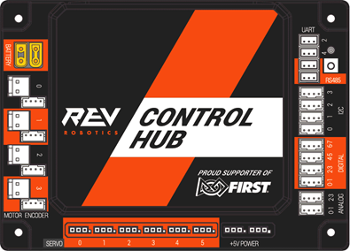

# Control Hub

# Contents
- [Control Hub](#control-hub)
- [Contents](#contents)
  - [Required materials](#required-materials)

## Required materials

- Control Hub (REV-31-1595)
- 12V Slim Battery (REV-31-1302)
- Driver Hub (REV-31-1596)
- Gamepad (REV-31-2983, REV-39-1865, or an approved FTC gamepad)
- USB‑A to USB‑C cable (included with Control Hub)
- Windows PC with the [REV Hardware Client](https://docs.revrobotics.com/rev-hardware-client) installed 

<!-- TODO: Add instructions for setting up the Control Hub -->